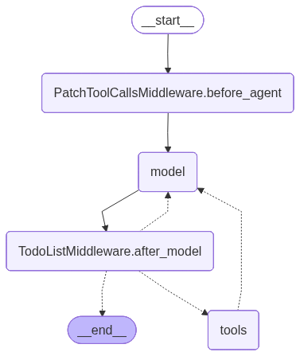
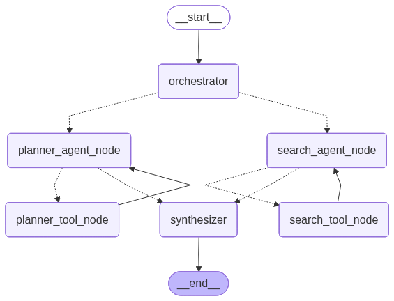

# Multi-agent-Travel-Planner
<div align="center">

# 🌍 Multi-Agent Travel Planner



**An intelligent, multi-agent system that plans your entire trip — from flights to hotels — using autonomous AI collaboration.**

---

</div>

## 🧭 Overview

The **Multi-Agent Travel Planner** is an AI-driven system that leverages multiple specialized agents to collaboratively plan travel itineraries. Each agent focuses on a specific domain — such as flight search, hotel booking, or destination research — and communicates with others to produce a cohesive, optimized travel plan.

This project demonstrates **autonomous agent collaboration**, **parallel task execution**, and **contextual reasoning** using **Large Language Models (LLMs)**.

---

## 🚀 Features

- 🤖 **Multi-Agent Collaboration** — Agents communicate and share context to refine travel plans.
- ✈️ **Flight Search Automation** — Finds best flight options using APIs.
- 🏨 **Hotel Search Automation** — Suggests hotels based on preferences and budget.
- 🔍 **Deep Research Agent** — Gathers insights about destinations, attractions, and local experiences.
- 🧩 **Graph-based Planning** — Uses a dynamic graph to manage agent interactions and dependencies.
- ⚙️ **LLM Integration** — Powered by OpenAI or compatible LLMs for reasoning and synthesis.

---

## 🧰 Project Structure

```
Multi-agent-Travel-Planner/
│
├── src/
│   ├── main.py                # Entry point for the system
│   ├── deepResearchAgent.py   # Agent for destination research
│   ├── flightSearchTool.py    # Handles flight search logic
│   ├── hotelSearchTool.py     # Handles hotel search logic
│   ├── plannerAgentNode.py    # Core planner agent
│   ├── graph.py               # Graph-based agent orchestration
│   ├── llm.py                 # LLM interface
│   └── ...                    # Other supporting modules
│
├── requirements.txt           # Python dependencies
├── README.md                  # Project documentation
├── deepAgent.png              # Architecture visualization
└── graph.png                  # Graph structure visualization
```

---

## 🧩 System Architecture

The system is composed of multiple **autonomous agents** that interact through a **graph-based planner**:



Each node represents an agent (e.g., `SearchAgent`, `PlannerAgent`, `DeepResearchAgent`), and edges represent communication or dependency relationships.

---

## 🧠 How It Works

1. **User Input** — The user provides a travel query (e.g., “Plan a 5-day trip to Tokyo under $2000”).
2. **Planner Agent** — Breaks down the query into sub-tasks (flights, hotels, attractions).
3. **Specialized Agents** — Each agent executes its task:
   - `FlightSearchTool` finds flight options.
   - `HotelSearchTool` finds accommodations.
   - `DeepResearchAgent` gathers local insights.
4. **Synthesis** — The `Synthesizer` agent combines all results into a coherent travel plan.
5. **Output** — The final itinerary is presented to the user.

---

## 🧑‍💻 Setup Instructions

### 1️⃣ Clone the Repository

```bash
git clone https://github.com/yourusername/Multi-agent-Travel-Planner.git
cd Multi-agent-Travel-Planner
```

### 2️⃣ Create a Virtual Environment

```bash
python3 -m venv venv
source venv/bin/activate  # On Windows: venv\Scripts\activate
```

### 3️⃣ Install Dependencies

```bash
pip install -r requirements.txt
```

### 4️⃣ Set Up API Keys

Create a `.env` file or edit the key files in `src/`:

```bash
OPENAI_API_KEY=your_openai_api_key
SERP_API_KEY=your_serp_api_key
TAVILY_API_KEY=your_tavily_api_key
```

Alternatively, you can directly modify:

- [`src/openAIKey.py`](src/openAIKey.py)
- [`src/serpApiKey.py`](src/serpApiKey.py)
- [`src/tavilyKey.py`](src/tavilyKey.py)

---

## 🧪 Running the Project

### Run the main orchestrator:

```bash
python src/main.py
```

### Example Interaction

**Input:**

```text
Plan a 7-day trip to Paris with a budget of $2500.
```

**Output:**

```text
🧭 Travel Plan Summary:

✈️ Flights: Round trip from SFO to CDG — $850
🏨 Hotels: 4-star stay near Eiffel Tower — $900
🎟️ Activities: Louvre, Seine Cruise, Versailles Day Trip — $400
🍽️ Dining & Misc: $350

✅ Total: $2500
```

---

## 🧩 Use Case: Multi-Agent Collaboration in Travel Planning

This project showcases how **autonomous agents** can collaborate to solve complex, real-world problems. Each agent operates independently but contributes to a shared goal.

### Example Workflow

| Agent | Responsibility | Example Task |
|--------|----------------|---------------|
| 🧠 PlannerAgent | Task decomposition | Split query into sub-tasks |
| 🔍 SearchAgent | Information retrieval | Find flight/hotel data |
| 🧳 DeepResearchAgent | Contextual enrichment | Research local attractions |
| 🧩 Synthesizer | Integration | Merge results into final plan |

---

## 🧱 Technologies Used

- **Python 3.10+**
- **OpenAI API** (LLM reasoning)
- **SERP API / Tavily API** (search tools)
- **NetworkX** (graph-based orchestration)
- **AsyncIO** (parallel agent execution)

---

## 🧠 Future Enhancements

- 🗺️ Add real-time flight/hotel booking integration
- 🧍‍♂️ Add user preference learning
- 🗣️ Add conversational interface (voice/text)
- 📱 Build a web dashboard for visualization

---

## 🧑‍🎓 Example Research Output

**Query:** “What are the best cultural experiences in Kyoto?”

**DeepResearchAgent Output:**

```text
1. Attend a traditional tea ceremony in Gion.
2. Visit Fushimi Inari Shrine early morning.
3. Explore Nishiki Market for local cuisine.
4. Participate in a kimono rental experience.
```

---

## 🧾 License

This project is licensed under the **MIT License** — feel free to use, modify, and distribute.

---

<div align="center">

**Built with ❤️ by AI Agents for Smarter Travel Planning**

</div>
